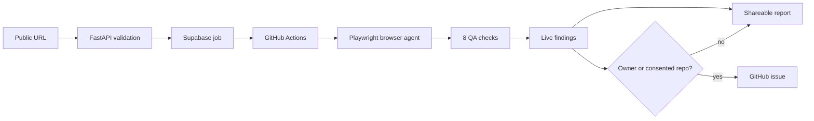

<div align="center">
  
  <h1>BugHound</h1>
  <p><strong>An autonomous website QA agent that finds the bugs real users hit.</strong></p>
  <p>
    <a href="https://bughound-web.vercel.app">Try BugHound</a> ·
    <a href="bughound-master-build-spec.md">Read the build spec</a> ·
    <a href="https://github.com/Aditya-tec/bughound/issues">See real issues</a>
  </p>
</div>

## Find bugs. Understand them. Ship the fix.

BugHound explores a live website like a careful user: it opens pages, follows links, scrolls, interacts with controls, checks browser state, and records evidence. It then turns that exploration into findings your team can actually act on.

The scan experience is deliberately visible. Watch the agent move through its pipeline, see what it has inspected, open the evidence behind each finding, and share the finished report with a link.

```text
  crawl  ----->  interact  ----->  inspect  ----->  report
    |                |                 |              |
    +-- pages        +-- actions       +-- evidence    +-- share or file
```

## What the agent checks

BugHound runs eight focused checks instead of producing one vague score:

| Check | What it looks for |
| --- | --- |
| Functional | JavaScript errors, failed requests, broken links, broken images, and forms that fail silently |
| Accessibility | Missing labels or alt text, contrast failures, ARIA problems, and keyboard issues |
| Performance | Core Web Vitals, slow responses, render-blocking resources, and oversized images |
| SEO | Titles, descriptions, H1s, canonical tags, Open Graph data, sitemaps, and robots.txt |
| Security hygiene | Passive header and cookie configuration issues, mixed content, and exposed source maps |
| Responsive | Mobile viewport metadata, horizontal overflow, small touch targets, and breakpoint breakage |
| Visual / UX | Layout problems, dead ends, placeholder content, and misleading or broken states |
| Multi-step flows | Checkout, signup, pagination, back-button, and state consistency across pages |

Every finding includes the page URL, severity, description, reproduction context, and the check that surfaced it. Open **How BugHound got here** to see the reasoning path instead of taking a black-box score on faith.

## Three ways to use it

### Scan mode

Submit any public URL. BugHound explores it in read-only mode and produces a shareable report. Nothing is written to the target site or to a repository.

### Owner mode

For domains you operate, the agent can automatically file findings as GitHub issues. The server enforces an operator-owned domain allowlist before the run can start.

### Connect GitHub

Scan mode stays read-only by default. If you own the scanned site, connect GitHub from the report, choose the repository through GitHub's installation flow, review the findings, and explicitly file the ones you want. The GitHub App only requests the issue-writing permission it needs.

## See it work

The live scan view is built to make waiting useful rather than mysterious:

- An animated progress rail shows crawl, interaction, inspection, and report stages.
- A terminal-style agent trace shows the latest verified work from the run.
- Findings arrive as the worker records them, so partial results survive an interrupted run.
- Expandable evidence sections explain which tier found a problem and what was observed.
- Completed runs offer both a shareable report and a direct GitHub handoff.

The dashboard uses a warm editorial interface with a deliberately technical edge: serif findings for readability, monospace run data for precision, and motion only where it communicates live state.

## How it works



The frontend runs on Next.js and Vercel. Lightweight API functions validate and orchestrate jobs. The expensive browser work runs in GitHub Actions with Playwright, then writes job progress and findings to Supabase for the dashboard to poll.

## Safety boundaries

BugHound is designed to be useful without becoming destructive:

- Public scans are read-only.
- Security checks are passive; they inspect headers, cookies, and already-linked resources rather than probing systems.
- The API validates targets against SSRF protections before the crawler connects and again before navigation hops.
- Owner-mode issue filing is restricted to configured domains.
- Scan-mode GitHub filing requires the site owner to install the GitHub App and confirm the repository and findings.
- Supabase tables use default-deny Row Level Security; the browser never receives the service-role key.

## Run it locally

### Requirements

- Node.js 20+
- Python 3.11+
- A Supabase project
- GitHub credentials for dispatch and optional issue filing
- Groq and Gemini API keys for the reasoning tiers

### Frontend

```powershell
cd apps/web
npm install
npm run dev
```

Open [http://localhost:3000](http://localhost:3000).

### Agent

```powershell
python -m venv .venv
.\\.venv\\Scripts\\Activate.ps1
pip install -r agent/requirements.txt
python -m agent.main
```

Copy the required environment variables from the deployment configuration into your local environment. The full API contract, schema, workflow, and deployment notes live in [bughound-master-build-spec.md](bughound-master-build-spec.md).

## Project map

```text
apps/web/       Next.js dashboard, scan view, reports, and GitHub handoff
api/            FastAPI serverless routes and auth/state boundaries
agent/          Playwright crawler, exploration graph, checks, and issue filing
supabase/       Schema and RLS migrations
fixtures/       Deliberately broken evaluation sites
```

## Development checks

```powershell
cd apps/web
npm run build

cd ../..
pytest agent/tests api/tests
```

## Technical reference

The detailed build spec covers the API contracts, database schema, deployment topology, crawler guardrails, GitHub authentication flow, evaluation suite, and security decisions. Start with [bughound-master-build-spec.md](bughound-master-build-spec.md) when you need implementation-level detail.

## License

See the repository license and contribution guidance before deploying BugHound against sites you do not own.

<div align="center">
  <sub>BugHound is for finding real problems before your users have to.</sub>
</div>
